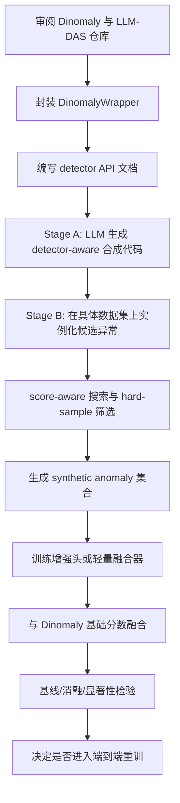

# 将 LLM-DAS 思想迁移到 Dinomaly 的工程实施报告

## 执行摘要

这项迁移不能理解为“把 LLM-DAS 的原始代码直接接到 Dinomaly 上”，而应理解为“把 **LLM-DAS 的两阶段思想** 迁移到 **以 Dinomaly 为评分器的图像异常检测系统**”：第一阶段让 LLM 只基于 **Dinomaly 的接口与机制** 生成“检测器感知”的异常合成策略；第二阶段在具体数据集上实例化这些策略，生成 **hard synthetic anomalies**，并通过 **辅助增强头或轻量融合器** 提升最终检测分数。LLM-DAS 原始开源仓库是 **表格异常检测** 路线，仓库 README 明确其复现对象是 tabular anomaly detection，而 Dinomaly 是 **多类图像 UAD**，因此需要彻底重写数据接口、评分接口与增强训练路径，而不是复用其 predictor 训练脚本。citeturn23view0turn2view1 fileciteturn0file0 fileciteturn0file1

当前最高可执行、风险最低的方案，是先做一版 **faithful transplantation**：保留 Dinomaly 主干与原始重建训练方式，把“整个 Dinomaly 模型”封装成 `DinomalyWrapper`，对外暴露 `predict_score / predict_map / extract_features` 三组符号接口；随后按 LLM-DAS 的思路在这些接口上做图像空间、特征空间与 score-aware 搜索三类 hard anomaly 合成，再训练一个轻量增强模块，并按 **归一化基分数 + 归一化增强分数** 的方式融合，最后再进入更激进的端到端重训版本。这个切分最接近 LLM-DAS 论文中的“原 detector + enhancement classifier + score fusion”范式，同时最大限度减少对 Dinomaly 主干代码的侵入。fileciteturn0file0 citeturn11view1turn12view1turn40view0

已明确的源码事实包括：Dinomaly 默认使用 DINOv2-Register 的 ViT-Base/14 编码器、8 个中层目标层、两组 loose reconstruction 分组、MLP bottleneck dropout、LinearAttention2 解码器块、`global_cosine_hm_percent` 损失、输入 resize 448 后 center crop 到 392、并以 anomaly map 前 1% 像素均值作为图像分数。LLM-DAS 仓库 README 则明确采用两条路径：Path A 复现已有 query 输出，Path B 调用 LLM 生成“检测器描述→代码提示→合成代码”，关键文件包括 `query_pipeline.py`、`get_answer.py`、`run_job_baseline.py`、`presets/`、`prompt/` 与多个 baseline predictor 文件。citeturn6view0turn12view1turn12view6turn30view4turn38view1turn40view0turn23view0 fileciteturn0file1

本报告中的未指定项会明确标注为“未指定”。就当前信息而言，**目标数据集、目标硬件、目标 LLM 服务商、最终是仅做两阶段增强还是连 Dinomaly 主干一起重训**，均属于未指定；因此实施计划默认优先覆盖 MVTec / VisA / Real-IAD，并以 Dinomaly 官方复现环境作为可落地参考起点。citeturn2view1turn30view0 fileciteturn0file1

## 目标与迁移原则

本项目的目标不是复刻 LLM-DAS 的表格实现，而是把其核心思想翻译成适用于图像 UAD 的工程范式。更准确地说，迁移目标应定义为：

**把 LLM-DAS 的“检测器感知、数据无关代码生成 + 数据集实例化 hard anomalies + 增强器融合”思想，迁移到以 Dinomaly 为 detector 的图像异常检测系统中。** 这里的 detector 不是单独一个浅层分类器，而是 **整个 Dinomaly 模型**，它对外提供异常分数、异常图和中间特征三类可调用接口。LLM 在第一阶段不看真实图像，只看 detector API 文档与机制说明；第二阶段才在本地数据集上实例化、搜索、筛选 hard anomalies，这与 LLM-DAS 论文强调的 **data-agnostic code generation** 一致。fileciteturn0file0 citeturn23view0turn11view1turn12view1turn40view0

需要明确写出的项目假设如下。

| 项目 | 当前状态 | 说明 |
|---|---|---|
| 目标数据集 | 未指定 | 建议优先 MVTec-AD、VisA、Real-IAD；它们也是 Dinomaly 论文和官方脚本的主基准。citeturn3view3turn2view1 fileciteturn0file1 |
| 目标硬件 | 未指定 | Dinomaly 官方 README 与补充材料使用 RTX 3090 24GB、Python 3.8、PyTorch 1.12.0 + CUDA 11.3。citeturn2view1turn30view0 fileciteturn0file1 |
| 目标 Python / Torch 版本 | 部分已知 | Dinomaly 已知为 Python 3.8.12 / torch 1.12.0+cu113；LLM-DAS 在仓库首页未逐行显式列出版本，README 要求以 `environment.yml` 为准，Path B 才需要 `openai`。citeturn2view1turn30view0turn23view0 |
| 目标 LLM 提供方 | 未指定 | LLM-DAS 论文说明代码生成阶段使用 Gemini-2.5-Pro；但迁移到 Dinomaly 时，可以替换为任一可稳定返回代码的模型。fileciteturn0file0 |
| 增强方式 | 未指定 | 推荐先做“冻结 Dinomaly + 训练增强器 + score fusion”，再做“端到端重训 Dinomaly”的可选扩展。fileciteturn0file0 |

建议采用下图作为工程主流程。



从研究与工程一致性的角度，推荐把任务拆成两条路线并行推进。**主线方案** 是 faithful transplantation：它最接近 LLM-DAS 原式，风险最低，也最容易做出可解释的 ablation。**备选方案** 是 deep integration：把 synthetic anomalies 直接写入 Dinomaly 训练目标中，例如加入 rank loss、map alignment loss 或 synthetic-vs-normal contrastive loss。这条路线更可能拿到更高上限，但训练不稳定性与过拟合风险会明显更高。fileciteturn0file0 fileciteturn0file1

## 仓库审查与兼容性分析

下表基于两者的官方仓库首页、README、文件树与 Dinomaly 关键源码页整理，目标是明确“必须下载/审阅什么，以及为什么”。其中，前两项是本项目必审仓库，后两项属于依赖级参考仓库，用于核对骨干网络与 checkpoint 兼容性。citeturn2view0turn3view3turn23view0turn36view0turn37view3 fileciteturn0file0 fileciteturn0file1

| 仓库 | 角色 | 必审文件/模块 | 审查重点 |
|---|---|---|---|
| `HangtingYe/LLM_DAS` | 思想来源与 prompt/code pipeline 原仓库 | `README.md`、`query_pipeline.py`、`get_answer.py`、`run_job_baseline.py`、`main_baseline_pyod.py`、`presets/`、`prompt/`、`answer/`、`Catboost_predictor.py` / `MLP_predictor.py` / `RF_predictor.py` / `SVM_predictor.py` | 两阶段流程如何组织、LLM 生成内容如何缓存、baseline 与增强版如何对比、如何用 preset 批量跑实验、如何定义“detector 说明→合成代码→实验表格”的闭环。README 已明确 Path A/Path B 与关键输出目录。citeturn23view0 |
| `guojiajeremy/Dinomaly` | 目标 detector 的官方实现 | `dinomaly_*_uni.py`、`dataset.py`、`models/uad.py`、`models/vision_transformer.py`、`models/vit_encoder.py`、`utils.py`、`requirements.txt` | 模型结构、编码器/解码器/瓶颈层、特征分组、attention 类型、损失函数、异常图与图像分数计算、训练/评估入口、外部 backbone 下载与 checkpoint key 兼容。citeturn2view0turn3view3turn30view0turn11view1turn12view1turn38view1turn40view0turn36view0turn37view3 |
| `facebookresearch/dinov2` | 编码器权重与 register token 语义来源 | 官方 ViT / register token 实现、checkpoint 结构 | Dinomaly 的 `vit_encoder.py` 直接下载 DINOv2 / DINOv2-Register 权重，且用 `strict=False` 加载；如果未来更换 backbone 或升级 Dinomaly2 / DINOv3，此仓库是排查 register token、插值与权重键名问题的第一参考。citeturn36view0turn37view3 |
| `rwightman/pytorch-image-models` | 依赖级参考 | timm hub / model utils | Dinomaly 的下载缓存逻辑直接复用了 timm 风格下载函数，版本升级时要核对 hub helper 行为与 checkpoint 解析差异。citeturn37view3 |

接下来必须正视两者在“问题设定—输入输出—训练范式”上的根本不兼容性。LLM-DAS 的仓库与论文都聚焦 **tabular anomaly detection**，而 Dinomaly 是 **multi-class image UAD**；LLM-DAS 的 Stage B 是“把 synth anomalies 加到训练集里，再训练 enhancement classifier 并做 score fusion”，Dinomaly 则是“正常样本重建式训练 + encoder/decoder discrepancy 推断”。因此，**迁移的不是训练脚本，而是结构化思想与接口抽象**。citeturn23view0 fileciteturn0file0 fileciteturn0file1

下表给出逐模块的差异与兼容性问题，这是后续实现时最关键的决策依据。表中所有“改造建议”都以当前公开代码为基础，而不是凭空发明。citeturn6view0turn11view1turn12view1turn13view0turn30view4turn38view1turn40view0turn23view0

| 模块 | LLM-DAS 现状 | Dinomaly 现状 | 兼容性问题 | 建议 |
|---|---|---|---|---|
| 问题设定 | 表格 one-class AD，上层增强器是二分类器。fileciteturn0file0 | 多类图像 UAD，主模型是 encoder-bottleneck-decoder 重建差异。fileciteturn0file1 | 模态完全不同，不能复用原始 predictor 脚本。 | 只迁移“detector-aware synthesis + instance-time hard sample + fusion”思想。 |
| detector API | README 明确 Path B 通过 `query_pipeline.py` / `get_answer.py` 生成 detector-specific 代码，原论文强调对模型只暴露符号接口。citeturn23view0 fileciteturn0file0 | 原始 Dinomaly `forward` 返回 encoder/decoder 特征列表，评估函数在 `utils.py` 中再算 anomaly map 与 score。citeturn11view1turn12view1turn13view0turn40view0 | 现成代码没有 `predict_score/predict_map/extract_features` 这种统一接口。 | 先封装 `DinomalyWrapper`，再让 LLM 只面向 wrapper API 编码。 |
| 输入格式 | 表格特征矩阵 `X_train`。fileciteturn0file0 | 预处理后张量为 `[B,3,392,392]`；默认先 resize 448 后 center crop 392。citeturn6view0turn30view4 | 图像空间合成必须发生在 crop 对齐坐标系中，否则 mask 与 score map 会错位。 | 统一在 wrapper 中固定 preprocess/postprocess，并明确坐标变换。 |
| 特征形状 | 向量式。 | ViT-Base/14 默认 spatial size 推断为 `28×28`；两组融合特征各自约为 `[B,768,28,28]`，这是由 `392/14=28` 与两组 fuse 配置推得。citeturn6view0turn12view1 | LLM-DAS 的“样本”概念要重新定义成图像、patch token 或 fused feature group。 | 提供三层接口：image / patch / fused group。 |
| grouping 策略 | 无对应概念。 | 默认 `fuse_layer_encoder=[[0,1,2,3],[4,5,6,7]]`，decoder 同样两组；这是 loose reconstruction 的代码实现。citeturn6view0turn12view1 | 如果只返回单层特征，会损失 Dinomaly 的关键 inductive bias。 | `extract_features()` 默认返回“两组 fused maps”，而不是单层 tokens。 |
| attention 实现 | 与图像 attention 无关。 | Decoder block 默认使用 `LinearAttention2`，内部用 `elu(x)+1`、`kv` 因式分解而非 softmax attention。citeturn38view1 fileciteturn0file1 | hard anomaly 若过于局部、单点化，未必最能打击 Dinomaly；因为 decoder 本身就是 unfocused 的。 | 图像空间合成优先做“中尺度、结构扰动、跨区域一致性破坏”，而非只扎一个小洞。 |
| 损失与训练 | 用 synthetic anomalies 训练 enhancement classifier，并与原 detector 分数做 min-max 归一化求和。fileciteturn0file0 | 用 `global_cosine_hm_percent` 做 hard-mining cosine loss，训练集默认仅正常样本。citeturn12view6turn6view0 | 直接把 anomaly 加回 Dinomaly 原训练可能破坏其 one-class 假设。 | 第一阶段不要改主损失；先加辅助增强头，复刻 LLM-DAS 融合思路。 |
| 评分方式 | 基 detector score + enhancement score。fileciteturn0file0 | `predict_map` 对应的 anomaly map 先上采样，再高斯平滑；图像分数取 top 1% 像素均值。citeturn13view0turn40view0 | hard sample 的“难度”不能只看单一分数，还要看 map 是否落在合成区域上。 | 采用 `score + map overlap + perturbation` 的联合 hardness。 |
| checkpoint | 仓库首页可见结果目录、模型目录，但首页未逐行公开全部内部保存逻辑。citeturn23view0 | `vit_encoder.py` 动态下载 backbone 权重，并 `strict=False` 加载。citeturn36view0turn37view3 | backbone 名称、register token、strict=False 都可能导致复现实验时 silent mismatch。 | 自定义 checkpoint 必须保存：backbone 名、target layers、fuse groups、crop size、是否 reg token。 |
| 依赖版本 | README 要求按 `environment.yml` 建环境，Path B 才需要 `openai`。首页未能逐行审到 yml 细节。citeturn23view0 | Python 3.8.12，torch 1.12.0+cu113，torchvision 0.13.0+cu113，timm 0.9.12。citeturn2view1turn30view0 | LLM SDK 往往更偏新版本 Python，而 Dinomaly 停在旧栈。 | 强烈建议拆成两个环境或 Docker 多阶段镜像。 |
| 评估指标 | AUC-PR / AUC-ROC，跨 36 个 tabular benchmark 做 paired one-tailed t-test。fileciteturn0file0 | Image AUROC/AP/F1-max，Pixel AUROC/AP/F1-max/AUPRO。fileciteturn0file1 | 统计检验粒度不同。 | 图像侧建议对“类别级指标 + 种子均值”做 paired test / Wilcoxon / bootstrap。 |

从工程角度，我建议把 `HangtingYe/LLM_DAS` 仓库只当作 **prompt orchestration 参考** 与 **思想基线**，而把所有真正运行在图像上的训练/评分/筛选逻辑，都放到一个新的 `llm_das_dinomaly/` 子工程中。这样可以避免把表格 AD 的脚本、preset、结果格式硬塞到图像 UAD 中，造成不可维护的“半耦合系统”。citeturn23view0turn2view0

## DinomalyWrapper API 设计

Dinomaly 官方实现的模型主入口并不是面向“合成器/搜索器/打分器”设计的接口，而是面向训练脚本设计的：`forward` 直接返回 encoder/decoder 特征列表；异常图与图像分数是在 `utils.py` 中另算出来的。为了让 LLM-DAS 的“symbolic interfaces”迁移成立，第一优先级任务是给 Dinomaly 做一个稳定、可测试、可缓存的 wrapper，把源码内部约定显式化。citeturn11view1turn12view1turn13view0turn40view0 fileciteturn0file0

建议的最小 API 如下：

```python
from __future__ import annotations
from dataclasses import dataclass
from typing import Any, Dict, Iterable, List, Literal, Optional, Sequence, Tuple, Union

import torch
import torch.nn as nn
import torch.nn.functional as F
from PIL import Image

Tensor = torch.Tensor

@dataclass
class DinomalyConfig:
    backbone: str = "dinov2reg_vit_base_14"
    image_size: int = 448            # resize size
    crop_size: int = 392             # center crop size
    resize_mask: Optional[int] = 256 # eval-time resize, None means keep crop_size
    target_layers: Tuple[int, ...] = (2, 3, 4, 5, 6, 7, 8, 9)
    fuse_layer_encoder: Tuple[Tuple[int, ...], ...] = ((0, 1, 2, 3), (4, 5, 6, 7))
    fuse_layer_decoder: Tuple[Tuple[int, ...], ...] = ((0, 1, 2, 3), (4, 5, 6, 7))
    bottleneck_dropout: float = 0.2
    topk_ratio: float = 0.01
    gaussian_kernel: int = 5
    gaussian_sigma: float = 4.0
    device: str = "cuda"

class DinomalyWrapper(nn.Module):
    """
    A detector-style wrapper around Dinomaly.
    All synthetic anomaly generators should program against this API only.
    """

    def __init__(
        self,
        model: nn.Module,
        cfg: DinomalyConfig,
        mean: Sequence[float] = (0.485, 0.456, 0.406),
        std: Sequence[float] = (0.229, 0.224, 0.225),
    ) -> None:
        super().__init__()
        self.model = model.eval()
        self.cfg = cfg
        self.register_buffer("mean", torch.tensor(mean).view(1, 3, 1, 1), persistent=False)
        self.register_buffer("std", torch.tensor(std).view(1, 3, 1, 1), persistent=False)

    @torch.no_grad()
    def preprocess(
        self,
        images: Union[Tensor, Sequence[Image.Image]],
        normalize: bool = True,
    ) -> Tensor:
        """
        Input:
            - Tensor [B,3,H,W] in [0,1] or list[PIL]
        Output:
            - Tensor [B,3,crop_size,crop_size], normalized
        """
        x = self._to_bchw(images)                     # user-defined helper
        x = F.interpolate(
            x, size=(self.cfg.image_size, self.cfg.image_size),
            mode="bilinear", align_corners=False
        )
        margin = (self.cfg.image_size - self.cfg.crop_size) // 2
        x = x[:, :, margin:margin+self.cfg.crop_size, margin:margin+self.cfg.crop_size]
        if normalize:
            x = (x - self.mean) / self.std
        return x

    @torch.no_grad()
    def forward_features(self, x: Tensor) -> Dict[str, Any]:
        """
        Input:
            x: [B,3,crop,crop]
        Output:
            {
              'encoder_groups': list[[B,C,Hf,Wf]],
              'decoder_groups': list[[B,C,Hf,Wf]],
            }
        """
        en, de = self.model(x)
        return {"encoder_groups": en, "decoder_groups": de}

    @torch.no_grad()
    def extract_features(
        self,
        x: Tensor,
        *,
        which: Literal["encoder", "decoder", "both"] = "encoder",
        flatten_tokens: bool = False,
    ) -> Union[List[Tensor], Dict[str, List[Tensor]]]:
        out = self.forward_features(x)
        if which == "encoder":
            feats = out["encoder_groups"]
            return [f.flatten(2).transpose(1, 2) if flatten_tokens else f for f in feats]
        if which == "decoder":
            feats = out["decoder_groups"]
            return [f.flatten(2).transpose(1, 2) if flatten_tokens else f for f in feats]
        return out

    @torch.no_grad()
    def predict_map(
        self,
        x: Tensor,
        *,
        resize_to: Optional[int] = None,
        smooth: bool = True,
    ) -> Tensor:
        """
        Output:
            anomaly map [B,1,H,W]
        """
        out = self.forward_features(x)
        amap = self._cosine_anomaly_map(
            out["encoder_groups"], out["decoder_groups"], out_size=x.shape[-1]
        )
        if resize_to is not None:
            amap = F.interpolate(amap, size=(resize_to, resize_to), mode="bilinear", align_corners=False)
        if smooth:
            amap = self._gaussian_blur(amap, kernel=self.cfg.gaussian_kernel, sigma=self.cfg.gaussian_sigma)
        return amap

    @torch.no_grad()
    def predict_score(
        self,
        x: Tensor,
        *,
        topk_ratio: Optional[float] = None,
        resize_to: Optional[int] = None,
    ) -> Tensor:
        """
        Output:
            score [B]
        """
        amap = self.predict_map(x, resize_to=resize_to, smooth=True)
        ratio = self.cfg.topk_ratio if topk_ratio is None else topk_ratio
        flat = amap.flatten(1)
        k = max(1, int(flat.shape[1] * ratio))
        score = torch.topk(flat, k=k, dim=1).values.mean(dim=1)
        return score

    @torch.no_grad()
    def score_candidates(
        self,
        x_ref: Tensor,
        x_cands: Tensor,
        *,
        synth_masks: Optional[Tensor] = None,
    ) -> Dict[str, Tensor]:
        """
        For hard-sample search / filtering.
        Returns score, score_delta, map, overlap, magnitude.
        """
        s_ref = self.predict_score(x_ref)
        s_cand = self.predict_score(x_cands)
        amap = self.predict_map(x_cands)
        out = {
            "score_ref": s_ref,
            "score_cand": s_cand,
            "score_delta": s_cand - s_ref,
            "map": amap,
            "perturb_l1": (x_cands - x_ref).abs().flatten(1).mean(1),
        }
        if synth_masks is not None:
            m = F.interpolate(synth_masks.float(), size=amap.shape[-2:], mode="nearest")
            out["mask_overlap"] = (amap * m).flatten(1).sum(1) / (m.flatten(1).sum(1) + 1e-6)
        return out
```

这套 API 的设计依据与必要性很直接。Dinomaly 训练脚本使用 `dataset.py` 中的 `Resize -> ToTensor -> CenterCrop -> Normalize` 预处理，默认 `image_size=448`、`crop_size=392`；`ViTill.forward()` 会取目标层特征、做 fuse、经 bottleneck 与 decoder 后返回 encoder/decoder 特征组；异常图由 `cal_anomaly_maps()` 通过 `1 - cosine_similarity` 计算，并在 `evaluation_batch()` 中做高斯平滑与图像级 top-k 聚合。把这些行为统一挪到 wrapper，是为了让合成器不再依赖分散在训练脚本与 utils 里的隐式约定。citeturn30view4turn11view1turn12view1turn13view0turn40view0

需要给调用方写清楚的张量形状如下。对于默认 backbone `dinov2reg_vit_base_14`，`crop_size=392`，因 `392/14=28`，故 fused map 的空间尺寸可推得为 `28×28`；默认两组特征每组通道维为 768，这来自 ViT-Base 配置与训练脚本里对 `embed_dim=768, num_heads=12` 的设置。若使用 small/large，通道分别变为 384/1024，large 的 target layers 也会改成 `[4,6,8,10,12,14,16,18]`。这部分在 wrapper 文档中必须显式列出，否则 feature-space 合成和增强头输入维度会频繁出错。citeturn6view0 fileciteturn0file1

| API | 输入 | 输出 | 默认形状说明 |
|---|---|---|---|
| `preprocess` | PIL 列表或 `[B,3,H,W]` | `[B,3,392,392]` | 对齐 Dinomaly 官方预处理。citeturn30view4turn6view0 |
| `extract_features(which="encoder")` | `[B,3,392,392]` | `list[Tensor]` | 默认两组，每组约 `[B,768,28,28]`；small 为 384，large 为 1024。citeturn6view0turn12view1 |
| `predict_map` | `[B,3,392,392]` | `[B,1,392,392]` 或 `[B,1,256,256]` | 先算 group-wise cosine discrepancy，再上采样与平滑。citeturn13view0turn40view0 |
| `predict_score` | `[B,3,392,392]` | `[B]` | top 1% 像素均值，和论文/补充材料一致。citeturn40view0 fileciteturn0file1 |
| `score_candidates` | 参考图 + 候选图 + 可选 mask | 分数字典 | 专为 Stage B 搜索与 hard filter 准备。 |

从依赖管理角度，这个 wrapper 应单独建一个最小依赖层。Dinomaly 官方 requirements 锁在相对旧的视觉栈上：`torch==1.12.0+cu113`、`torchvision==0.13.0+cu113`、`timm==0.9.12`、`numpy==1.18.4` 等；同时官方 README 明确推荐 Python 3.8.12。LLM-DAS 的 README 则说明 `openai` 只在 Path B 需要。因此最稳妥的工程拆法是：**视觉训练环境** 与 **LLM 代码生成环境** 分离，前者只负责 Dinomaly 与数据集，后者负责 prompt orchestration 与代码产出。citeturn2view1turn30view0turn23view0

## 合成策略与 hard-sample 机制

LLM-DAS 的可迁移核心，不是某段具体 Python 代码，而是三件事：其一，LLM 不看真实数据，只看 detector 机制；其二，真正的数据依赖发生在本地实例化阶段；其三，增强不是靠“随便造异常”，而是靠造 **对当前 detector 恰好难** 的异常。把这三点落实到 Dinomaly 上，最自然的分解就是：**图像空间合成、特征空间合成、score-aware 搜索** 三路并行，最后由统一的 hard-sample scorer 做筛选。fileciteturn0file0 citeturn11view1turn12view1turn40view0

先给出总体建议：第一版不要把 LLM 直接放进闭环里“在线写代码再执行”。更可靠的落地方式是先做 **human-authored baseline policies**，把接口、缓存、评估与安全沙箱打通；待 baseline 政策稳定后，再把这些 policy 模板换成 LLM 生成版本。这比一开始就把“LLM 生成代码质量波动”混进实验误差要稳健得多，也更容易做消融。这个建议仍然符合 LLM-DAS 的思想，因为其本质是 detector-aware synthesis，而不是强依赖某个特定 LLM。fileciteturn0file0

下表给出三类策略的推荐实现方式、参数区间与 Dinomaly 调用点。

| 策略 | 核心思路 | 参数范围建议 | mask / patch 生成 | 融合与边界处理 | Dinomaly 调用点 |
|---|---|---|---|---|---|
| 图像空间合成 | 在正常图上做局部结构破坏、纹理错位、颜色/频谱扰动，再用 `predict_score`/`predict_map` 选“中等偏难”样本 | 覆盖率 0.5%–12%；连通块 1–4；alpha 0.3–0.8；位移 2–12 px；模糊 sigma 0.5–3.0 | Perlin/brush/random polygon/patch-grid/superpixel mask；同图或同 batch copy-shift / cut-paste / elastic warp / local FFT noise | 高斯 feather 边缘 3–11 px；反射 padding；值域 clamp；尽量保持背景统计不变 | `predict_score`、`predict_map` |
| 特征空间合成 | 在 fused encoder feature 上进行 patch token swap、channel dropout、局部 whitening/noise、跨区域 mixup，训练增强头而非反渲染回图像 | 影响 patch 数 4–64（28×28 网格）；mix coeff 0.2–0.8；noise sigma 0.05–0.5×feature std；group 选择 low/high/both | 以 anomaly map 低响应区域或 border-line score 的 patch 作为 seed；也可随机选局部块 | 特征上直接 blend；若做 group aware，则分别对 2 组特征注入扰动后拼接统计量 | `extract_features`、`predict_score` |
| score-aware 搜索 | 以 border-line normal 为种子，反复提议变换并保留落在目标“hardness band”中的候选 | 迭代 8–32 步；每步保留 top 1–4 候选；目标 z-score 1.0–3.0；扰动上限 L1 0.02–0.08 | 组合调用图像空间操作；也可在 patch 网格上做 token-level proposals | 接受准则同时看 score、map overlap、perturbation、stability；保持 mask 面积与连通性约束 | `predict_score`、`predict_map`、可选 `extract_features` |

下面给出三类策略的伪代码草案。它们都假定调用者只依赖 `DinomalyWrapper`，从而与 Dinomaly 内部实现解耦。

**图像空间合成伪代码**

```python
def synthesize_image_space(wrapper, x_norm, n_try=16):
    x0 = wrapper.preprocess(x_norm)
    seeds = select_borderline_normals(wrapper, x0, q=(0.80, 0.95))
    out = []

    for x in seeds:
        for _ in range(n_try):
            mask = sample_mask(
                h=x.shape[-2], w=x.shape[-1],
                area_ratio=(0.005, 0.12),
                mode=random.choice(["perlin", "brush", "polygon", "patch"])
            )
            op = random.choice([
                "copy_shift", "elastic_warp", "local_blur",
                "fft_noise", "cutpaste_same_image", "color_jitter_local"
            ])
            x_syn = apply_local_op(x, mask, op)
            x_syn = feather_blend(x, x_syn, mask, radius=random.randint(3, 11))
            x_syn = x_syn.clamp(x.min(), x.max())

            meta = wrapper.score_candidates(x[None], x_syn[None], synth_masks=mask[None])
            if accept_hard(meta):
                out.append((x_syn, mask, meta))
    return out
```

**特征空间合成伪代码**

```python
def synthesize_feature_space(wrapper, x_norm):
    x = wrapper.preprocess(x_norm)
    feats = wrapper.extract_features(x, which="encoder")  # list of fused groups

    syn_feat_bank = []
    for group_id, f in enumerate(feats):
        # f: [B, C, Hf, Wf]
        patch_mask = sample_patch_mask(H=f.shape[-2], W=f.shape[-1], n_patch=(4, 64))
        f_seed = select_borderline_patch_tokens(f, patch_mask)

        f_syn = f.clone()
        f_syn = token_swap_or_mix(
            f_syn, patch_mask,
            mix_alpha=random.uniform(0.2, 0.8),
            noise_sigma=random.uniform(0.05, 0.5) * f.std()
        )
        syn_feat_bank.append({
            "group_id": group_id,
            "feat_syn": f_syn,
            "patch_mask": patch_mask
        })
    return syn_feat_bank
```

**score-aware 搜索伪代码**

```python
def score_aware_search(wrapper, x_norm, budget=24, target_z=2.0):
    x = wrapper.preprocess(x_norm)
    s0 = wrapper.predict_score(x)
    cand = x.clone()
    best = None

    stats = estimate_normal_stats(wrapper)  # mu_N, sigma_N on training normals
    for step in range(budget):
        cand_new, mask = propose_mutation(cand, step)
        meta = wrapper.score_candidates(x, cand_new, synth_masks=mask)
        z = (meta["score_cand"] - stats["mu"]) / (stats["sigma"] + 1e-6)
        H = hardness_score(
            z=z,
            overlap=meta.get("mask_overlap"),
            perturb=meta["perturb_l1"],
            stability=aug_stability(wrapper, cand_new)
        )
        if best is None or H > best["H"]:
            best = {"x": cand_new, "mask": mask, "meta": meta, "H": H}
        cand = cand_new if should_accept(H, step) else cand
    return best
```

hard sample 的筛选要从“**边界性**、**定位一致性**、**扰动可视性**、**分数稳定性**”四个维度同时考虑，而不能只看“分数越大越好”。如果只保留高分样本，最终拿到的往往是“太容易”的大面积、强纹理合成缺陷，它们会让增强器学到一个与真实异常分布错位的决策边界。Dinomaly 本身的图像级分数就是 anomaly map 的 top-k 聚合，因此最合理的 hard 样本应是：**图像分数高于普通正常样本、但未高到显然异常；异常图在合成区域上有响应、但不是整图泛化；扰动强度受控；在弱增广下分数排序稳定。** citeturn40view0 fileciteturn0file0

推荐使用如下 hardness 公式，其中所有统计量均在 **训练正常集** 上估计：

\[
z(x)=\frac{s(x)-\mu_N}{\sigma_N+\epsilon}
\]

\[
H(x_{\text{syn}})=
\exp\left(-\frac{|z-z^\*|}{\tau_z}\right)
\cdot
\exp\left(-\frac{|r-r^\*|}{\tau_r}\right)
\cdot
\exp\left(-\frac{p}{\tau_p}\right)
\cdot
\exp\left(-\frac{u}{\tau_u}\right)
\]

其中：

- \( s(x) \) 为 `predict_score(x)`；
- \( r \) 为合成 mask 与 anomaly map 的归一化重叠度；
- \( p \) 为平均 L1 扰动幅度；
- \( u \) 为对弱增广 \(T_a\) 后分数的标准差；
- 建议默认 \( z^\*=2.0, \tau_z=0.75, r^\*=0.4, \tau_r=0.15, \tau_p=0.03, \tau_u=0.2\sigma_N \)。

对应的阈值建议如下：保留 `z ∈ [1.0, 3.0]` 的候选；若 `z < 0.5` 视为“太像正常”；若 `z > 4.0` 视为“太容易”；mask 面积低于 `0.5%` 或高于 `15%` 的候选直接丢弃；`r` 低于 `0.15` 说明异常图没有对准合成区，也应该丢弃；`u > 0.25σ_N` 说明样本对轻微增广不稳定，多半是伪硬样本。这个区间的目的是把搜索目标锁定在“靠近边界但已经略越界”的区域，和 LLM-DAS 论文对 hard anomalies 的叙述保持一致。fileciteturn0file0 citeturn40view0

样本保留策略建议分两级。**局部级**：每张正常图最多保留 2–4 个 hard candidates，避免少数类别或纹理模式灌满缓存。**全局级**：第一轮实验把 synthetic:normal 比例限制在 `0.25:1`，第二轮消融提升到 `0.5:1` 与 `1.0:1`。此外要做重复样本去重：若两候选在 Dinomaly encoder 特征上的 cosine 相似度大于 `0.98`，或像素 L2 距离低于一个很小阈值，则只保留 hardness 更高者。这个策略可以显著降低“同一种伪缺陷被搜索器重复发现”的模式塌缩问题。citeturn11view1turn12view1

关于增强器形式，建议严格分成两层。第一版使用 **轻量增强头**，输入是 `score + map statistics + pooled fused features`，例如：

- `s_base`
- top-1% / top-5% / max score
- anomaly map 的面积、熵、中心偏移、连通块数量
- 两组 encoder fused feature 的 global avg / std / max
- 可选的 mask-overlap 特征

增强头可以是一个 2–3 层 MLP，或者一个“anomaly map 小 CNN + fusion MLP”。最终分数遵循 LLM-DAS 式融合：

\[
F(x)=\text{Norm}(s_{\text{base}}(x))+\beta \cdot \text{Norm}(s_{\text{aux}}(x))
\]

其中 \(\beta\) 默认取 `1.0`，并在 `{0.25, 0.5, 1.0, 2.0}` 上做网格搜索。这样做的优点是：**主干 Dinomaly 不被破坏；LLM-DAS 思想最忠实；实验因果链最清晰**。fileciteturn0file0

## 工程任务与实验设计

以下时间表按“单名熟悉 PyTorch 的工程师”估算。因为用户未指定硬件，时间均以 **未指定硬件** 为前提；若使用 Dinomaly 官方参考环境（RTX 3090 24GB），基础复现耗时可按同级别视觉项目经验估算，但仍建议把“训练时间”作为变量单独记录。Dinomaly 官方环境与建议 GPU 规格可作为参考基线。citeturn2view1turn30view0

| 任务阶段 | 输入 | 产出 | 关键代码/脚本 | 测试/验证方法 | 预估时间 |
|---|---|---|---|---|---|
| 环境冻结与基线复现 | Dinomaly 官方仓库、目标数据集路径 | 可稳定运行的 Dinomaly baseline；记录依赖、hash、权重下载状态 | `dinomaly_mvtec_uni.py` / `dinomaly_visa_uni.py` / `dinomaly_realiad_uni.py`，新建 `scripts/reproduce_dinomaly.sh` | 复现实验至少一套数据集；检查指标是否接近论文/README 区间；核对预处理、top1% score、AUPRO 计算一致性 | 约 3–5 天，硬件未指定 |
| Wrapper 封装与单测 | 已跑通基线的 Dinomaly | `DinomalyWrapper`、API 文档、单元测试 | `wrappers/dinomaly_wrapper.py`、`tests/test_wrapper.py` | 对同一批输入比较 wrapper 与原 `evaluation_batch()` 的 score/map 数值差；误差阈值建议 < 1e-5 到 1e-4 | 约 2–3 天 |
| synthetic policy 基线库 | Wrapper、正常训练样本 | 不依赖 LLM 的 rule-based 合成库 | `synth/image_ops.py`、`synth/feature_ops.py`、`synth/mask_generators.py` | 可视化 100–200 个候选；检查坐标对齐、边界融合、mask 覆盖率分布 | 约 4–6 天 |
| score-aware 搜索与 hard filter | 基线合成库、Wrapper、训练正常集 | 候选搜索器、hardness scorer、缓存格式 | `search/score_aware.py`、`search/hardness.py`、`cache/*.parquet|pt` | 检查 normal/synthetic score 分布；命中目标 z-band 的比例；重复率；稳定性指标 | 约 4–5 天 |
| faithful transplantation 增强器 | synthetic hard set、baseline Dinomaly outputs | 轻量增强头与最终融合器 | `enhancer/map_feature_head.py`、`train_enhancer.py`、`infer_fused.py` | 与纯 Dinomaly 比较 image/pixel 指标；检查 per-class 收益是否集中在少数类 | 约 4–6 天，硬件未指定 |
| 端到端重训扩展 | faithful 版本结果、synthetic hard set | 可选的 joint training 分支 | `train_dinomaly_joint.py`、`losses/rank_map_loss.py` | 监控训练稳定性、验证集过拟合、normal reconstruction 是否崩塌 | 约 1 周，硬件未指定 |
| 消融、统计检验与报告 | 全部实验日志与结果文件 | 完整对照表、显著性检验与复现实验包 | `analysis/ablation.ipynb`、`analysis/stats.py` | paired t-test / Wilcoxon / bootstrap CI；至少 3 seeds | 约 3–4 天 |

实验上，应该把“忠实迁移”和“高风险上探”分开，不要一开始就把所有新想法混进一个系统里。建议先固定一个主基线：**官方 Dinomaly**。然后逐步加模块，保证每一步都能回答“LLM-DAS 的哪一部分思想带来了收益”。Dinomaly 论文与官方仓库都覆盖 MVTec-AD、VisA、Real-IAD 三个主基准，因此这是最自然的优先实验顺序；若还要考察结构异常与逻辑异常的差异，可把 MVTec LOCO 放入扩展集。citeturn3view3turn2view1 fileciteturn0file1

| 实验组 | 改动 | 目的 | 数据集建议 | 评价指标 | 统计方法 |
|---|---|---|---|---|---|
| Baseline | 原始 Dinomaly | 复现与回归基线 | MVTec / VisA / Real-IAD | I-AUROC、I-AP、I-F1、P-AUROC、P-AP、P-F1、AUPRO | 3 seeds，报告均值±std |
| Image-only | 仅图像空间 synthetic + hard filter + enhancer | 验证最直观迁移路径 | 同上 | 同上 + synthetic 命中率 | per-class paired t-test / Wilcoxon |
| Feature-only | 仅特征空间 synthetic + enhancer | 验证 feature-space 比 image-space 是否更稳 | 同上 | 同上 | per-class paired t-test / Wilcoxon |
| Search-only | 图像空间 + score-aware 搜索，但无 feature-space | 验证“hardness 搜索”是否是关键增益源 | 同上 | 同上 | paired test |
| Full faithful | image + feature + search + enhancer fusion | 忠实复刻 LLM-DAS 思想 | 同上 | 同上 | paired test + bootstrap 95% CI |
| Joint finetune | Full faithful + 端到端 rank/map loss | 验证更深层整合是否进一步提升 | 先 MVTec，再 VisA | 同上 | paired test；额外记录训练稳定性 |
| Ablation on hardness | 改 z-band、mask 面积、synthetic ratio、β | 找最稳参数区间 | MVTec 优先 | image/pixel 全指标 | ANOVA 或配对比较 |
| Ablation on groups | low group / high group / both groups | 验证 loose reconstruction 的哪部分更敏感 | MVTec / VisA | I-AUROC、AUPRO | paired test |

具体统计检验建议如下。若以 **类别** 为独立样本，则 MVTec 有 15 类、VisA 有 12 类、Real-IAD 有 30 类，可以对每类的 I-AUROC、P-AUROC、AUPRO 计算 paired difference；若再跨 3 个随机种子求均值，则可在类别级上做 **paired t-test** 与 **Wilcoxon signed-rank test** 双报告。若想更稳健，也可对图像级分数或像素级分数做 bootstrap，给出 95% CI。之所以建议双检验，是因为图像 AD 的类别数通常并不大，而 LLM-DAS 论文虽然在 36 个 tabular benchmark 上做了 paired one-tailed t-test，但图像侧的样本结构与独立性假设并不完全等价。fileciteturn0file0 fileciteturn0file1

在实验执行顺序上，我建议先只跑 **MVTec** 完成所有模块打通，因为它类别数适中、社区对结果敏感、可视化反馈最快；随后迁移到 **VisA** 检验泛化；最后上 **Real-IAD** 检验大规模多视角复杂场景。只有在 MVTec 与 VisA 上看到稳定正收益之后，才值得把重型搜索与 joint finetune 投到 Real-IAD 上，否则很容易把大量时间消耗在“系统尚未定型”的大数据实验里。这个顺序也和 Dinomaly 论文主展示顺序一致。fileciteturn0file1

## 风险、限制与下一步行动

最大风险不是“合成不出来异常”，而是“合成出来的异常 **太容易、太假、太偏**”。LLM-DAS 在表格域中强调的是 near-boundary hard anomalies；映射到图像域后，如果你只做简单 CutPaste 或大面积局部噪声，增强器会学到“伪缺陷检测器”，而不是帮助 Dinomaly 修补其真实 blind spots。缓解方式有三条：第一，严格使用前文的 hardness band，而不是只看高分；第二，做 per-class 可视化审查，确认 hard samples 分布在边界附近而不是远离正常 manifold；第三，把 synthetic ratio 控制在小比例并做逐步扩展。fileciteturn0file0 citeturn40view0

第二类风险是 **训练不稳定与 one-class 假设被破坏**。Dinomaly 的成功高度依赖 Noisy Bottleneck、Linear Attention、Loose Reconstruction 与 hard-mining cosine loss 的组合；如果你过早把 anomaly supervision 强行注入主干，可能会破坏 decoder 的“只会恢复正常模式”这一 epistemic 特性。缓解方式是先走 faithful transplantation：主干冻结或仅轻微 finetune，增强器单独训练；当且仅当这个版本稳定有效，再做端到端 joint training。fileciteturn0file1 citeturn12view6turn38view1

第三类风险是 **环境与 checkpoint 兼容**。Dinomaly 依赖较旧的 Python/Torch 栈，并在 `vit_encoder.py` 中动态下载多种 backbone 权重、`strict=False` 加载 state dict；而 LLM orchestration 通常更适合新版本 SDK。缓解方式很明确：把视觉栈与 LLM 栈隔离；所有生成代码都经过 AST 白名单 / subprocess 沙箱执行；所有 checkpoint 必须附带 metadata，包括 backbone、patch size、crop size、target layers、fuse groups、register token 配置。citeturn2view1turn30view0turn36view0turn37view3

第四类风险是 **LLM 生成代码不可复现**。LLM-DAS 原始仓库通过 `answer/description`、`prompt/4code`、`answer/code/<llm_type>/` 等目录把 prompt 与产物落盘，这个做法在图像版本里必须保留，而且要更严格：除了保存 prompt、response、代码文件，还要保存执行时的 wrapper 文档版本、normal stats、随机种子、候选筛选阈值与最终采纳比例。否则你会很难回答“提升来自 LLM 思想，还是来自偶然写出来的一版代码”。citeturn23view0

当前审查仍有一个客观限制：`LLM_DAS` 仓库首页与 README 已足够确定它的两阶段流程、关键目录与运行路径，但本次浏览环境未能把 `environment.yml`、`query_pipeline.py` 等文件逐行展开到和 Dinomaly 同样的细粒度。因此，关于 **LLM_DAS 内部 orchestration 的精确函数签名与环境锁定细节**，本报告把它列为“本地 clone 后必须补做的核验项”，而不是在这里臆造实现细节。这不会影响迁移主方案，但会影响你要不要复用其 prompt/cache 目录组织形式。citeturn23view0

下一步行动清单建议如下：

- 先冻结一份 **Dinomaly baseline 复现实验包**，确保 `wrapper.predict_score/predict_map` 与官方 `evaluation_batch()` 数值一致。
- 建立 `llm_das_dinomaly/` 子工程，优先实现 **human-authored** 图像空间合成、feature-space 合成与 hardness scorer，不要一开始就接 LLM。
- 先完成 **faithful transplantation**：冻结 Dinomaly 主干，仅训练增强头，并用 `Norm(base_score) + β * Norm(aux_score)` 做融合。
- 在 **MVTec** 上完成全套消融后，再迁移到 **VisA** 和 **Real-IAD**；没有 MVTec 的稳定正收益，不建议直接上大规模数据集。
- 最后再接入 LLM Path B，把 wrapper API 文档、prompt 模板、代码缓存、沙箱执行链路补齐，并把每轮生成的代码纳入版本管理。