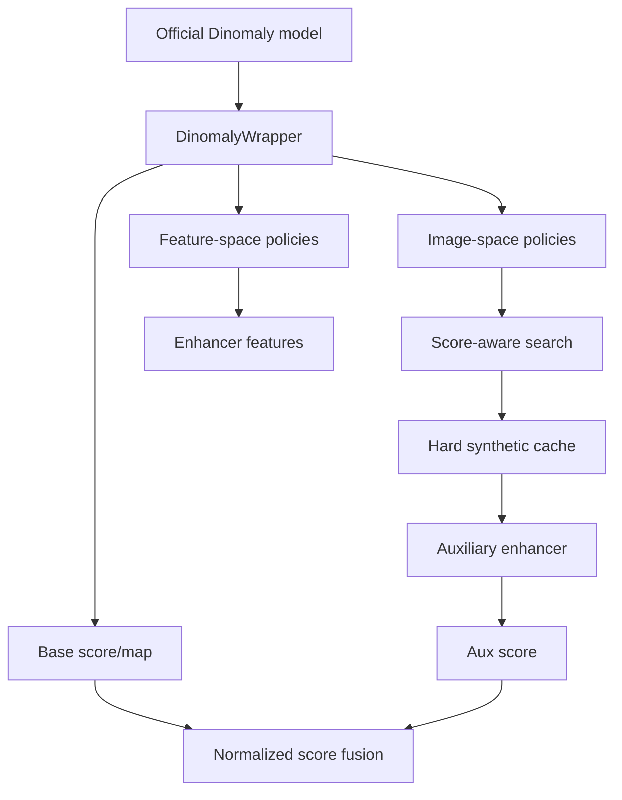

# Architecture

The code follows the report's faithful-transplantation route.

## Module Boundaries

`wrappers/` is the only module that knows how a Dinomaly-style model exposes
encoder and decoder groups. Synthetic policies, search code, enhancer code, and
future LLM-generated policies should call only the wrapper API.

`synth/` contains human-authored baseline policies. These are intentionally
simple and deterministic enough to test before any LLM code generation is
introduced.

`search/` implements the near-boundary hard-sample logic from the report:
score z-band, map/mask overlap, perturbation magnitude, and optional stability.

`enhancer/` keeps the Dinomaly backbone frozen. It builds compact features from
base scores, anomaly maps, and pooled fused features, then produces an auxiliary
score for min-max fusion.

`llm/` is a record-keeping layer for Path B. It does not execute generated code;
it saves prompts, responses, code, wrapper metadata, normal-score stats, and
thresholds so later experiments are reproducible.

## Integration Steps

1. Reproduce the official Dinomaly baseline in its own visual environment.
2. Construct `DinomalyWrapper(official_model, DinomalyConfig(...))`.
3. Verify `predict_map` and `predict_score` against the original evaluation
   routine on the same batch.
4. Generate synthetic proposals with `synth/`, then filter them with `search/`.
5. Train an enhancer with frozen Dinomaly outputs.
6. Report baseline, image-only, feature-only, search-only, full faithful, and
   optional joint-finetune experiments separately.

## Server Runner

`scripts/run_server_mvtec.sh configs/server_mvtec.yaml` is the first real-data
entrypoint. It expects `DATA_ROOT`, `CHECKPOINT_PATH`, and `OUTPUT_ROOT` from
the server environment, uses `third_party/Dinomaly` by default, and runs a small
MVTec smoke pipeline before scaling the same code to fuller runs.
