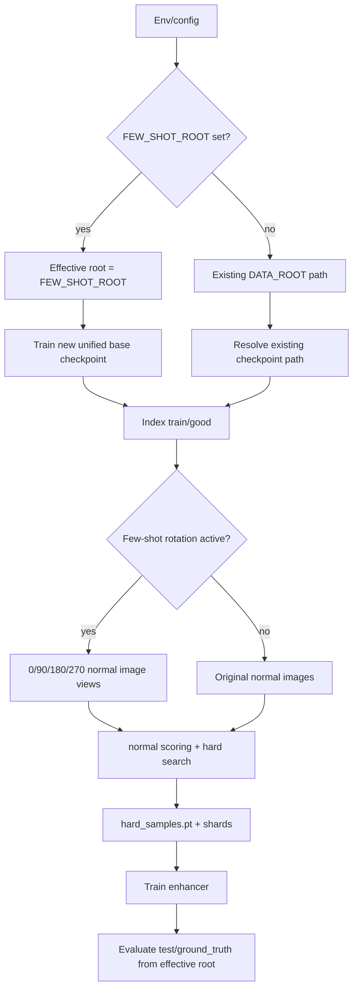

# feat: Add few-shot rotation pipeline

## Summary

本计划为现有 server pipeline 增加 MVTec、MPDD、ViSA 共用的 few-shot rotation 跑法。`FEW_SHOT_ROOT` 设置后成为 effective dataset root，few-shot 模式强制训练新的 unified Dinomaly base checkpoint，再用 `0/90/180/270` normal image views 生成 hard samples、训练 enhancer，并在同 root 的完整 test split 上评估。

---

## Problem Frame

当前 pipeline 已支持 MVTec 与 MPDD，并且 cache context 已经能隔离 dataset/root/checkpoint。新的 few-shot 实验需要三个变化同时成立：dataset root 不能与 full-data root 混用，base checkpoint 不能复用已有权重，少量正常图需要通过四向旋转扩展后再进入 hard-sample search。ViSA 也要进入同一条 unified server pipeline，但输入前提是 Dinomaly 官方预处理后的 `VisA_pytorch/1cls` MVTec-like 目录。

---

## Requirements

**Dataset and root behavior**

- R1. `FEW_SHOT_ROOT` 设置后必须成为训练、base training、hard samples、enhancer 和 evaluation 的唯一 effective root。
- R2. `FEW_SHOT_ROOT` 未设置时，现有 `DATA_ROOT`、checkpoint resolution、MVTec 和 MPDD 行为必须保持兼容。
- R3. Dataset dispatch 必须支持 `mvtec`、`mpdd`、`visa`，并沿用 MVTec-like category layout。
- R4. ViSA 必须按预处理后的 `1cls` 目录读取，不在本版处理原始 ViSA + CSV prepare。

**Few-shot base training**

- R5. few-shot 模式必须训练新的 unified base checkpoint，不复用显式 `CHECKPOINT_PATH` 或本地搜索命中的旧 checkpoint。
- R6. few-shot 模式仍沿用官方 Dinomaly recipe 的 DINOv2 pretrained encoder 初始化。
- R7. run summary 必须说明 base checkpoint 是 few-shot mode 新训练得到的，而不是复用。

**Rotation augmentation**

- R8. 正常训练图片必须在 preprocessing 前扩展为 `0`、`90`、`180`、`270` 度图像视图。
- R9. Rotated views 必须保留 normal label、source path、category 和 rotation metadata。
- R10. Rotated views 必须参与 normal score statistics、hard-sample search 和 enhancer training。
- R11. Evaluation images 和 masks 本版不得做 rotation augmentation。

**Caching and observability**

- R12. hard-sample shard、final hard-sample cache 和 enhancer checkpoint 的 cache context 必须包含 effective root、few-shot active state、rotation angles 和 base checkpoint path。
- R13. 不同 full/few-shot root、不同 rotation angles、不同 base checkpoint 之间不能静默复用 cache。
- R14. run summary 必须记录 dataset、effective root、few-shot root、rotation angles、base normal image 数、rotated normal view 数、selected categories 和 checkpoint 来源。

---

## Key Technical Decisions

- **Effective root first:** 在 pipeline 早期解析 `effective_data_root = FEW_SHOT_ROOT or DATA_ROOT`，后续 dataset、base training 和 evaluation 都只接收 effective root。这样最不容易出现训练和评估混 root。
- **Few-shot training overrides checkpoint resolution:** few-shot mode 进入 `all` 或 `base-train` 时跳过显式 checkpoint 与搜索复用，直接训练新的 run-local unified checkpoint。这样满足“都是从头训练”，同时保留非 few-shot 现有兼容路径。
- **Rotation as dataset views:** 用 dataset/view wrapper 在 PIL image 层产生四向旋转视图，而不是旋转 feature map。这样 wrapper preprocess、Dinomaly forward、hard-sample search 都看到真实旋转图像。
- **ViSA as MVTec-like dataset spec:** ViSA 复用现有 MVTec-like loader contract，只新增 `VISA_CLASSES` 和 dataset dispatch。原始数据 prepare 继续由官方脚本负责。
- **Cache context carries experiment identity:** cache context 扩展为 root、few-shot、rotation、checkpoint 的组合身份。cache 是否可复用由 metadata 判断，不靠文件名猜测。

---

## High-Level Technical Design

---

## Implementation Units

### U1. Add ViSA dataset dispatch

- **Goal:** 让 `DATASET=visa` 使用预处理后的 `VisA_pytorch/1cls` MVTec-like root 进入现有 indexing、training 和 eval contract。
- **Requirements:** R3, R4
- **Dependencies:** None
- **Files:** `llm_das_dinomaly/data/visa.py`, `llm_das_dinomaly/data/__init__.py`, `llm_das_dinomaly/pipelines/server_mvtec.py`, `tests/test_config_and_mvtec.py`
- **Approach:** 新增 `VISA_CLASSES` 和 thin wrapper dataset，复用 MVTec train/test list helpers。把 `visa` 加入 `DATASET_SPECS`，默认 smoke category 可用 `candle`。
- **Patterns to follow:** `llm_das_dinomaly/data/mpdd.py` 复用 MVTec-like helpers 的方式。
- **Test scenarios:** fake ViSA root 包含 `candle/train/good`、`candle/test/good|bad`、`candle/ground_truth/bad` 时，ViSA train/test indexer 能读到 normal、good test、bad test 和 mask；`DATASET=visa` full mode 展开 12 类；unknown dataset 仍报清晰错误。
- **Verification:** ViSA fake dataset 单测通过，MVTec/MPDD 现有 dataset 测试不变。

### U2. Resolve effective few-shot root and config contracts

- **Goal:** 引入 `FEW_SHOT_ROOT`，并让 effective root 在 pipeline 的所有 dataset reads 中替代 `DATA_ROOT`。
- **Requirements:** R1, R2, R14
- **Dependencies:** U1
- **Files:** `llm_das_dinomaly/pipelines/server_mvtec.py`, `configs/server_mvtec.yaml`, `configs/server_mpdd.yaml`, `configs/server_paths.example.env`, `configs/server_paths_mpdd.example.env`, `tests/test_server_pipeline.py`, `tests/test_config_and_mvtec.py`
- **Approach:** 在 config 的 data 层增加 optional few-shot root 字段，run pipeline 早期解析 effective root。summary 同时记录 configured data root 和 effective root，避免服务器日志误读。
- **Patterns to follow:** 当前 `require_path(data_cfg["root"], kind="DATA_ROOT")` 与 env expansion pattern。
- **Test scenarios:** `FEW_SHOT_ROOT` 设置时 check stage 的 `data_root` 或新增 `effective_data_root` 指向 few-shot root；unset 时 summary 与现有行为一致；missing few-shot root 报 `FEW_SHOT_ROOT` 相关错误；eval stage 使用 effective root 的 fake test split。
- **Verification:** root 解析测试覆盖 train/eval 两条路径，现有 check/eval tests 不需要改调用方式。

### U3. Force few-shot base training from the effective root

- **Goal:** few-shot 模式下不复用已有 Dinomaly checkpoint，每次训练新的 unified base checkpoint 后再进入 hard samples 和 eval。
- **Requirements:** R5, R6, R7
- **Dependencies:** U2
- **Files:** `llm_das_dinomaly/pipelines/server_mvtec.py`, `tests/test_server_pipeline.py`
- **Approach:** 在 checkpoint resolution 前判断 few-shot active。few-shot active 时跳过 explicit checkpoint 和 local checkpoint search，按 effective root、dataset、categories 调用 base training，并把结果 checkpoint 作为本 run 的 base checkpoint。
- **Patterns to follow:** `_resolve_base_checkpoint()`、`train_unified_dinomaly_checkpoint()` 和 MPDD base-training tests。
- **Test scenarios:** few-shot active 且 `CHECKPOINT_PATH` 指向旧文件时，`all` stage 仍调用 base training；few-shot active 且本地存在 matching checkpoint 时也不搜索复用；base training 收到 effective root 而不是 original `DATA_ROOT`；non-few-shot path 继续允许 explicit checkpoint 和 search reuse。
- **Verification:** fake `train_unified_dinomaly_checkpoint` 调用参数证明 root/categories 正确，summary 说明 checkpoint source 为 new few-shot training。

### U4. Add rotated normal-view dataset expansion

- **Goal:** 在 PIL image 层把 `train/good` 正常图扩展为 `0/90/180/270` views，并保持 metadata 可追踪。
- **Requirements:** R8, R9, R10, R11
- **Dependencies:** U2
- **Files:** `llm_das_dinomaly/data/mvtec.py`, `llm_das_dinomaly/data/__init__.py`, `llm_das_dinomaly/pipelines/server_mvtec.py`, `tests/test_config_and_mvtec.py`, `tests/test_server_pipeline.py`
- **Approach:** 新增通用 view dataset wrapper，包装任何 good dataset 并在 `__getitem__` 中返回 rotated PIL image。metadata 包含 `source_path`、`rotation_degrees` 和原始 record identity。
- **Patterns to follow:** `MVTecGoodDataset.__getitem__()` 的 `(image, meta)` contract 和 `_iter_dataset_batches()` 的 metadata 传递。
- **Test scenarios:** 两张 normal 图在 few-shot rotation active 时 dataset length 为八；每个 source path 对应四个 rotation metadata；`0` 度 view 与原图尺寸一致；`90/270` 对非方图产生符合 PIL rotate expand 语义的尺寸或按选定策略保持可 preprocess；unset few-shot rotation 时长度保持原始图数量。
- **Verification:** hard-sample generation mock wrapper 看到 rotated view 数，source_records 中保留 rotation metadata。

### U5. Extend hard-sample and enhancer cache identity

- **Goal:** 防止 full-data、不同 few-shot root、不同 rotations、不同 newly trained checkpoint 之间误复用 hard samples 或 enhancer。
- **Requirements:** R12, R13
- **Dependencies:** U2, U3, U4
- **Files:** `llm_das_dinomaly/pipelines/server_mvtec.py`, `tests/test_server_pipeline.py`
- **Approach:** 扩展 `_cache_context()` 和 `_normalize_cache_context()`，加入 `effective_data_root` 或 data root、few-shot active state、rotation angles、base checkpoint path。shard、final cache、enhancer checkpoint 都沿用同一个 context。
- **Patterns to follow:** 当前 `_cache_context_matches()`、`_try_summarize_hard_cache()`、`_try_summarize_enhancer_checkpoint()` mismatch tests。
- **Test scenarios:** full-data cache 不能用于 few-shot run；不同 `FEW_SHOT_ROOT` 不能互相复用；rotation angles 不同不能复用；new base checkpoint path 不同不能复用；matching context 仍能复用 cache 和 enhancer。
- **Verification:** mismatch tests 覆盖 hard cache、shards 和 enhancer checkpoint 三种 artifact。

### U6. Add ViSA and few-shot server runner surfaces

- **Goal:** 让服务器能通过 env/config 明确跑 MVTec、MPDD、ViSA few-shot rotation，并让示例模板说明新的 root 和训练语义。
- **Requirements:** R1, R3, R4, R5, R14
- **Dependencies:** U1, U2, U3
- **Files:** `configs/server_visa.yaml`, `configs/server_paths_visa.example.env`, `scripts/run_server_visa.sh`, `scripts/run_server_mvtec.sh`, `scripts/run_server_mpdd.sh`, `README.md`, `docs/EXPERIMENT_PLAN.md`, `tests/test_config_and_mvtec.py`
- **Approach:** 新增 ViSA 专用 config/runner/template，并把 `FEW_SHOT_ROOT` 加入现有 MVTec/MPDD runner override allowlist。few-shot 示例命令强调 `CHECKPOINT_PATH` 在 few-shot active 时不用于复用 base checkpoint。
- **Patterns to follow:** `configs/server_mpdd.yaml` 和 `scripts/run_server_mpdd.sh` 的 dataset-specific wrapper 模式。
- **Test scenarios:** ViSA config 在缺少 `CHECKPOINT_PATH` 但 few-shot/root/base training 配置有效时能 load；runner allowlist 包含 `FEW_SHOT_ROOT`；example env 不包含本机路径或 secret；MVTec/MPDD templates 保持现有 required vars。
- **Verification:** config/env tests 证明 YAML expansion 和 runner override contract 可用。

### U7. Update run summary and evaluation observability

- **Goal:** 让 run artifacts 足以解释 few-shot 实验用了哪个 root、多少原始 normal 图、多少 rotated views、哪个 base checkpoint。
- **Requirements:** R7, R14
- **Dependencies:** U2, U3, U4, U5
- **Files:** `llm_das_dinomaly/pipelines/server_mvtec.py`, `tests/test_server_pipeline.py`, `README.md`
- **Approach:** summary 增加 few-shot block，包含 active state、configured roots、effective root、rotation angles、base normal image count、rotated normal view count 和 checkpoint training source。保留现有 `num_normal_images` 语义或新增更明确字段，避免破坏旧读者。
- **Patterns to follow:** 当前 `run_summary.json` 的 top-level summary 和 `hard_samples` summary 结构。
- **Test scenarios:** few-shot active 的 check stage 输出 base normal count 和 rotated view count；all stage summary 记录 newly trained checkpoint source；unset few-shot 时 summary 不产生误导性 rotation counts；eval metrics 仍来自 effective root 的 full test set。
- **Verification:** fake root 测试可从 summary 判断 shot 数、rotated view 数和 evaluation root。

---

## Scope Boundaries

- 本计划不实现测试时 rotation averaging。
- 本计划不实现小角度或任意角度插值旋转。
- 本计划不把 rotation views 标成 pseudo-anomaly。
- 本计划不从原始 ViSA 数据和 split CSV 生成 `VisA_pytorch/1cls`。
- 本计划不把 DINOv2 encoder 改成随机初始化。
- 本计划不改变 enhancer 的 pixel-level 能力边界，pixel metrics 仍来自 base Dinomaly anomaly map。

---

## Risks And Dependencies

- **Few-shot base training cost:** 每次 few-shot run 都训练新的 unified base checkpoint，服务器耗时会比复用 checkpoint 明显增加。计划通过 summary 和 docs 明确这个行为。
- **Rotation validity varies by category:** 四向旋转对纹理类更自然，对方向固定零件可能引入分布偏移。这个风险属于实验假设，后续用指标判断。
- **ViSA layout assumption:** 如果用户提供的是原始 VisA 而不是预处理后 `1cls`，loader 会找不到 MVTec-like 目录。计划用 docs 和错误信息把这个前提写清楚。
- **Cache invalidation strictness:** 新 context 会让旧 artifacts 不复用，这是预期行为。实现时要优先清晰 warning，而不是静默重算。

---

## Documentation And Operational Notes

- README 需要给出 MVTec、MPDD、ViSA few-shot run 示例，强调 `FEW_SHOT_ROOT` 是完整 root。
- Server env templates 需要说明 few-shot active 时会训练新的 base checkpoint，`CHECKPOINT_PATH` 不作为复用入口。
- 实验文档需要保留 full-data 与 few-shot 的差异，避免把 few-shot 指标和此前 MVTec full-data checkpoint 指标混在一起比较。

---

## Sources And Research

- `docs/brainstorms/2026-06-08-few-shot-rotation-augmentation-requirements.md` 是本计划的 origin。
- `llm_das_dinomaly/pipelines/server_mvtec.py` 是当前 dataset dispatch、base checkpoint resolution、hard-sample generation、enhancer training、evaluation 和 cache context 的主线。
- `llm_das_dinomaly/data/mvtec.py` 和 `llm_das_dinomaly/data/mpdd.py` 展示了当前 MVTec-like loader contract。
- `third_party/Dinomaly/dinomaly_visa_uni.py` 和 `third_party/Dinomaly/prepare_data/prepare_visa.py` 表明 ViSA 官方路径使用预处理后的 `VisA_pytorch/1cls` 结构。
- `tests/test_config_and_mvtec.py` 和 `tests/test_server_pipeline.py` 是新增 dataset、root resolution、cache guard 和 runner/config 行为的主要测试落点。
