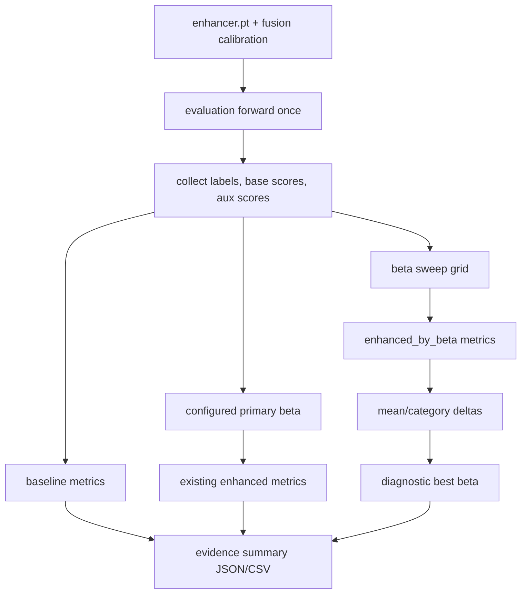

# feat: Add enhancer evidence sweep

## Summary

本计划把 enhancer 的有效性验证从“单个 beta 的一次最终 enhanced 指标”改成可复现的 evidence sweep：固定 base 和 enhancer checkpoint 后，一次 eval 产出多个 fusion beta 的 baseline/enhanced/delta 表、best diagnostic beta、per-category gain/loss 统计和可直接引用的 JSON/CSV 报告。目标是让后续实验能证明 enhancer 在保守融合下是否带来稳定增益，而不是靠手动重复改 env 跑多次。

---

## Problem Frame

当前 server pipeline 已经能训练 enhancer，并在每个 epoch 和最终评估中记录 baseline 与 enhanced 指标。但评估只使用一个 `EVAL_FUSION_BETA`，所以当默认 beta 过大时，enhancer 的弱正信号会被负类放大，实验只能得到“enhanced 不如 baseline”的结论。用户最近的 ViSA few-shot 结果显示 enhancer 从第 1 个 epoch 开始整体就是负增益，后续 epoch 继续变差；这说明需要先把融合权重、epoch 和模型容量的证据面展开，再谈有效性。

---

## Requirements

**Evidence sweep**

- R1. Pipeline 必须支持通过 env/config 配置一组 fusion beta，并在一次 enhanced eval 中复用同一次 detector/enhancer forward 计算所有 beta 的 image-level 指标。
- R2. Beta sweep 输出必须包含 `beta=0` 或等价 baseline 对照，并明确 enhanced 相对 baseline 的 mean delta 和 per-category delta。
- R3. Sweep 输出必须保留当前单 beta `enhanced` 字段兼容性，同时新增结构化 `enhanced_by_beta` 和 `beta_sweep` 诊断信息。
- R4. Best beta 必须标注为 diagnostic selection，不能把“在测试集上选出来的 best beta”伪装成无偏最终结论。

**Few-shot enhancer defaults**

- R5. Few-shot 模式必须能单独覆盖 enhancer epochs、hidden dim 和 learning rate，不影响 full-data enhancer 默认配置。
- R6. ViSA few-shot 推荐配置必须从激进默认转为保守默认或模板建议：短 epoch、小 hidden dim、低 learning rate、小 beta sweep。
- R7. Run summary 和 `effective_config.json` 必须记录 beta sweep、few-shot enhancer override 和 selection metric，保证实验可复现。

**Reporting**

- R8. Pipeline 必须写出机器可读的 beta sweep metrics 文件，便于比较不同 run。
- R9. 必须提供一个轻量 summary artifact 或脚本，把 mean delta、positive/negative category count、best diagnostic beta 和 per-category gain/loss 汇总成可粘贴到实验记录里的表。
- R10. Existing baseline/final enhanced metric files、per-epoch enhancer JSONL 和 eval-only 行为必须保持兼容。

---

## Key Technical Decisions

- **Sweep inside evaluation, not by rerunning eval:** 在 `evaluate_mvtec_detector()` 内收集一次 `base_scores` 和 `aux_scores`，再对 beta grid 做 CPU-side fusion 和 metric 计算。这样 beta sweep 几乎不增加 GPU forward 成本。
- **Keep current single-beta contract:** `EVAL_FUSION_BETA` 仍决定现有 `enhanced` 字段和 `final_enhanced_eval.json` 的 primary result；新增 sweep 字段和独立文件承载证据，不破坏旧脚本读取方式。
- **Diagnostic best beta is labeled:** `best_beta` 只说明这次 eval set 上哪个 beta 最好，用于调参和观察 enhancer 信号。最终论文/报告若要无偏声明，仍应固定 beta 或另设 validation split。
- **Few-shot enhancer gets its own budget knobs:** 新增 `FEW_SHOT_ENHANCER_HIDDEN_DIM` 和 `FEW_SHOT_ENHANCER_LR`，与现有 `FEW_SHOT_ENHANCER_EPOCHS` 一起只在 `FEW_SHOT_ROOT` active 时覆盖 `enhancer` 配置。
- **Evidence report reads artifacts, not server logs:** 报告脚本从 `run_summary.json` 和 metrics JSON 读取，避免依赖终端输出，也能回头分析旧 run。

---

## High-Level Technical Design

---

## Implementation Units

### U1. Add beta sweep parsing and config recording

- **Goal:** 让 pipeline 能从 YAML/env 读取 beta grid、selection metric 和是否启用 sweep，并把最终配置写进 run artifacts。
- **Requirements:** R1, R2, R7
- **Dependencies:** None
- **Files:** `configs/server_mvtec.yaml`, `configs/server_mpdd.yaml`, `configs/server_visa.yaml`, `configs/server_paths.example.env`, `configs/server_paths_mpdd.example.env`, `configs/server_paths_visa.example.env`, `scripts/run_server_mvtec.sh`, `scripts/run_server_mpdd.sh`, `scripts/run_server_visa.sh`, `llm_das_dinomaly/pipelines/server_mvtec.py`, `tests/test_config_and_mvtec.py`, `tests/test_server_pipeline.py`
- **Approach:** Add `evaluation.beta_sweep` and `evaluation.beta_selection_metric` fed by `EVAL_FUSION_BETA_SWEEP` and `EVAL_BETA_SELECTION_METRIC`. Parse comma-separated floats with stable ordering, normalize duplicates, and ensure the configured primary beta is included when sweep is active.
- **Patterns to follow:** Existing env expansion in `configs/server_*.yaml`, runner `OVERRIDE_CANDIDATES`, and `effective_config` recording in `llm_das_dinomaly/pipelines/server_mvtec.py`.
- **Test scenarios:** Config loads an empty sweep as disabled; config loads `0,0.01,0.05` as floats; duplicate beta values collapse; invalid beta values raise a clear `ValueError`; runner allowlists the new env keys; `effective_config.json` includes beta sweep and selection metric.
- **Verification:** Unit tests prove parsing and config recording work without requiring Dinomaly weights.

### U2. Compute multi-beta metrics in one evaluation pass

- **Goal:** Extend evaluation so enhanced metrics can be computed for many beta values after a single category forward pass.
- **Requirements:** R1, R2, R3, R10
- **Dependencies:** U1
- **Files:** `llm_das_dinomaly/evaluation/mvtec.py`, `llm_das_dinomaly/pipelines/server_mvtec.py`, `tests/test_mvtec_evaluation.py`, `tests/test_server_pipeline.py`
- **Approach:** Add an optional beta sweep argument to evaluation. `_evaluate_category()` should keep current `baseline` and primary `enhanced` output, then add `enhanced_by_beta` keyed by a stable beta string. Mean aggregation should produce matching `mean.enhanced_by_beta` values and beta deltas.
- **Patterns to follow:** Current `evaluate_mvtec_detector()` category loop, `_mean_category_metrics()`, and existing enhanced mode tests that assert wrapper/enhancer training modes are restored.
- **Test scenarios:** A fake wrapper/enhancer evaluation with three betas triggers exactly one wrapper forward per batch; `beta=0` image AUROC/AP/F1 match baseline rankings; existing callers without beta sweep get the old payload shape; primary `enhanced` still follows `EVAL_FUSION_BETA`; pixel metrics remain tied to the base anomaly map and are not duplicated per beta.
- **Verification:** Evaluation tests prove sweep adds no extra detector forward and preserves backward-compatible fields.

### U3. Write beta sweep artifacts for final, eval-only, and epoch evaluation

- **Goal:** Persist sweep evidence in predictable files for final evaluation, eval-only runs, and per-epoch enhancer diagnostics.
- **Requirements:** R3, R4, R8, R10
- **Dependencies:** U1, U2
- **Files:** `llm_das_dinomaly/pipelines/server_mvtec.py`, `tests/test_server_pipeline.py`, `README.md`, `docs/EXPERIMENT_PLAN.md`
- **Approach:** Teach `_run_and_write_evaluation()` to accept beta sweep settings and write the sweep fields into the normal metric JSON. For clarity, also write companion files such as `final_enhanced_beta_sweep.json`, `eval_beta_sweep.json`, and `enhancer_epoch_0001_beta_sweep.json` when sweep is enabled. Summary should include a compact `beta_sweep` block under the corresponding evaluation entry.
- **Patterns to follow:** Existing `baseline_eval.json`, `final_enhanced_eval.json`, `eval_enhanced.json`, and `enhancer_epochs.jsonl` output naming.
- **Test scenarios:** Final enhanced eval writes both the existing metric file and the sweep companion file; eval-only with an existing enhancer writes sweep output; per-epoch eval writes sweep output without stale epoch JSONL reuse; disabled sweep writes no companion file and keeps old behavior.
- **Verification:** Server pipeline tests assert file presence and summary structure for final, eval-only, and epoch paths.

### U4. Add few-shot-specific enhancer capacity and learning-rate overrides

- **Goal:** Let few-shot experiments use conservative enhancer capacity without changing full-data defaults.
- **Requirements:** R5, R6, R7
- **Dependencies:** U1
- **Files:** `configs/server_mvtec.yaml`, `configs/server_mpdd.yaml`, `configs/server_visa.yaml`, `configs/server_paths.example.env`, `configs/server_paths_mpdd.example.env`, `configs/server_paths_visa.example.env`, `llm_das_dinomaly/pipelines/server_mvtec.py`, `tests/test_config_and_mvtec.py`, `tests/test_server_pipeline.py`
- **Approach:** Extend `few_shot_training` with `enhancer_hidden_dim` and `enhancer_lr`. `_apply_few_shot_training_budget()` should override `enhancer.hidden_dim` and `enhancer.lr` only when few-shot is active. ViSA template should recommend `FEW_SHOT_ENHANCER_EPOCHS=1`, `FEW_SHOT_ENHANCER_HIDDEN_DIM=64`, and `FEW_SHOT_ENHANCER_LR=0.0001`.
- **Patterns to follow:** Existing `FEW_SHOT_BASE_TOTAL_ITERS`, `FEW_SHOT_BASE_EVAL_INTERVAL`, and `FEW_SHOT_ENHANCER_EPOCHS` override path.
- **Test scenarios:** Few-shot active replaces enhancer epochs, hidden dim, and lr; full-data leaves `ENHANCER_HIDDEN_DIM` and `ENHANCER_LR` unchanged; summary `few_shot.training_budget` records all three enhancer knobs; server env templates expose the new variables.
- **Verification:** Pipeline tests prove few-shot overrides reach `train_enhancer_from_cache()` arguments.

### U5. Generate enhancer evidence reports from run artifacts

- **Goal:** Provide a compact artifact that answers whether enhancer helped, where it helped, and which beta is diagnostic best.
- **Requirements:** R8, R9
- **Dependencies:** U2, U3
- **Files:** `scripts/summarize_enhancer_evidence.py`, `tests/test_server_pipeline.py`, `tests/test_config_and_mvtec.py`, `README.md`, `docs/EXPERIMENT_PLAN.md`
- **Approach:** Add a small dependency-light script that reads `run_summary.json` plus metric JSON files, then writes `metrics/enhancer_evidence_summary.json` and optionally a CSV table. The summary should include baseline mean, primary beta mean, best diagnostic beta mean, deltas, category gain/loss counts, and worst/best category rows.
- **Patterns to follow:** Existing dependency-light metrics code and JSON writer style; avoid pandas/sklearn.
- **Test scenarios:** Given a fake metric payload with positive and negative category deltas, the script reports correct mean deltas, gain/loss counts, best beta, and sorted worst/best categories; missing sweep payload yields a clear message rather than a traceback; old run summaries without `run_config` remain readable.
- **Verification:** Script tests run entirely from temporary JSON fixtures.

### U6. Document evidence-mode experiment commands and interpretation rules

- **Goal:** Update docs so future runs support enhancer-effectiveness claims without relying on hidden one-off env values.
- **Requirements:** R4, R6, R7, R9
- **Dependencies:** U1, U3, U4, U5
- **Files:** `README.md`, `docs/EXPERIMENT_PLAN.md`, `configs/server_paths_visa.example.env`, `configs/server_paths.example.env`, `configs/server_paths_mpdd.example.env`
- **Approach:** Add an “enhancer evidence mode” section that tells users to fix base/hard samples, retrain only enhancer when testing capacity, enable beta sweep, and interpret diagnostic best beta separately from fixed-beta claims. Keep server-local values in env files and point readers to `effective_config.json`.
- **Patterns to follow:** Current README server-run sections and experiment-plan reporting section.
- **Test scenarios:** Documentation examples include the new env keys; examples avoid inline one-off env prefixes for tracked experiments; warnings distinguish diagnostic best beta from final fixed-beta reporting.
- **Verification:** Documentation review confirms examples are copyable into server env files and do not include local secrets or generated artifact paths.

---

## Scope Boundaries

- This plan does not make enhancer a pixel-level segmenter; pixel metrics continue to come from the base Dinomaly map.
- This plan does not introduce validation splits for unbiased beta selection. It labels test-set best beta as diagnostic and leaves validation protocol design for a later experiment-design pass.
- This plan does not change synthetic anomaly generation policies or hard-sample search algorithms.
- This plan does not remove existing single-beta eval outputs.
- This plan does not add multi-seed orchestration; it only makes each single run easier to compare.

### Deferred to Follow-Up Work

- Add a validation split or leave-one-category-out protocol for selecting beta without touching the final test set.
- Add category-gated fusion, where categories harmed by enhancer can fall back to baseline after a validation rule is available.
- Make rotation angles configurable per run or per dataset class if direction-sensitive categories remain harmed.

---

## Risks And Dependencies

- **Test-set best beta can overstate gains:** The plan mitigates this by labeling best beta as diagnostic and keeping fixed-beta metrics primary.
- **JSON payload size grows:** Sweep metrics add per-beta category data. The cost is acceptable for 12 to 15 categories and a small beta grid, but docs should recommend compact grids.
- **Epoch sweep can be expensive only through eval frequency:** The beta grid itself is cheap; the existing per-epoch eval forward remains the expensive part. Defaults should keep few-shot epoch count small.
- **Backward compatibility matters:** Existing scripts may read `mean.enhanced`; implementation must add fields without renaming current ones.
- **Current result may still show no gain:** The feature proves enhancer effectiveness only if a conservative beta/epoch setting actually improves metrics. If it does not, the output still usefully proves non-effectiveness under tested settings.

---

## Acceptance Examples

- AE1. Given an existing enhancer checkpoint and `EVAL_FUSION_BETA_SWEEP=0,0.01,0.05`, when eval stage runs, then one eval pass writes metrics for all three betas and records deltas against baseline.
- AE2. Given `EVAL_FUSION_BETA=0.05`, when sweep also includes `0.1`, then existing `enhanced` fields represent `0.05` while `enhanced_by_beta` contains both `0.05` and `0.1`.
- AE3. Given few-shot mode with `FEW_SHOT_ENHANCER_HIDDEN_DIM=64`, when enhancer training starts, then `MapFeatureHead` is trained with hidden dim 64 while full-data mode still uses the normal enhancer config.
- AE4. Given a sweep where only `macaroni1` improves and several PCB classes drop, when the evidence summary is generated, then it reports one positive AUROC category, the negative categories, and the worst delta.
- AE5. Given sweep is disabled, when a legacy server run executes, then existing metric filenames and JSON fields remain compatible.

---

## Sources And Research

- `llm_das_dinomaly/pipelines/server_mvtec.py` owns config resolution, stage flow, enhancer training, per-epoch eval, final enhanced eval, and `effective_config.json`.
- `llm_das_dinomaly/evaluation/mvtec.py` already collects base scores and aux scores in one category pass, making beta sweep a CPU-side metric extension.
- `llm_das_dinomaly/enhancer/fusion.py` defines `fuse_scores()` as `base_norm + beta * aux_norm`, which makes small beta grids the right first diagnostic surface.
- `tests/test_server_pipeline.py` and `tests/test_mvtec_evaluation.py` already cover final enhanced eval, reused enhancer eval, epoch callback eval, and no-extra-forward behavior.
- `docs/brainstorms/2026-06-08-few-shot-rotation-augmentation-requirements.md` explains the few-shot root and rotation assumptions this plan preserves.
- The user-provided ViSA few-shot run summary showed `10` enhancer epochs, `2k` base iterations, and final enhanced mean AUROC below baseline, motivating conservative enhancer evidence mode.
